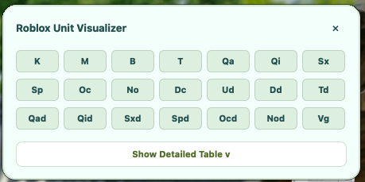
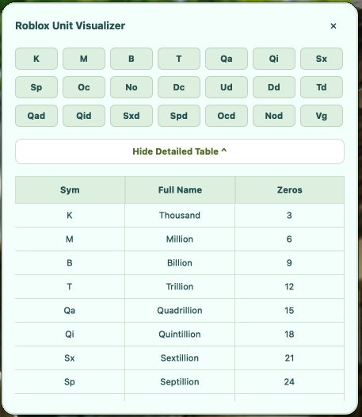

# Roblox Unit Visualizer 🚀

A lightweight, cross-platform system tray application designed for Roblox players and developers to easily visualize large unit scales (from **K** to **Vg**).

[](LICENSE)
[](https://github.com/dubo78/Roblox-Unit-Visualizer/releases/latest)
[](https://github.com/dubo78/Roblox-Unit-Visualizer/releases/latest)

---

## ✨ Features

- **Quick Dashboard**: View all 21 units (K to Vg) in a compact 7x3 grid layout.
- **Detailed Table**: Expand to see full names and zero counts for every unit.
- **Always on Top**: Keeps the visualizer visible while you play.
- **System Tray Integration**: Runs quietly in your taskbar (Windows) or menu bar (macOS).
- **Clean Aesthetic**: Modern Mint-colored UI with rounded corners and system fonts.

---

## 📥 Download

Get the latest version for your operating system:

👉 **[Download Latest Release](https://github.com/dubo78/Roblox-Unit-Visualizer/releases/latest)**

- **Windows**: Download `RobloxUnitVisualizer-Windows.exe`
- **macOS**: Download `RobloxUnitVisualizer-macOS.zip`, extract it, and move the `.app` to your Applications folder.

---

## 🛠 Installation (Source Code)

If you prefer to run from source (Python 3.12+ required):

1. **Clone the repository**:
   ```bash
   git clone https://github.com/dubo78/Roblox-Unit-Visualizer.git
   cd Roblox-Unit-Visualizer
   ```

2. **Install dependencies**:
   ```bash
   pip install -r requirements.txt
   ```

3. **Run the app**:
   ```bash
   python main.py
   ```

---

## 🖥 Screenshots

| Dashboard View | Detailed View |
| :---: | :---: |
|  |  |

---

## 📝 Unit Reference

| Symbol | Full Name | Zeros |
| :--- | :--- | :--- |
| **K** | Thousand | 3 |
| **M** | Million | 6 |
| **B** | Billion | 9 |
| ... | ... | ... |
| **Vg** | Vigintillion | 63 |

---

## 📜 License

Distributed under the MIT License. See `LICENSE` for more information.
